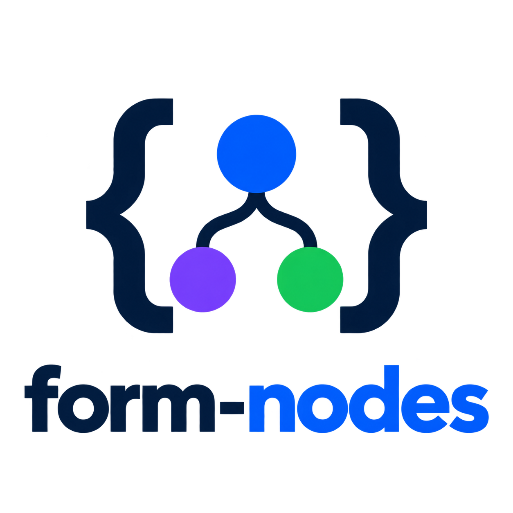

<p align="center">
  
</p>

<h1 align="center">Easy Signal-based forms for Angular</h1>

<p align="center">A typed forms library for <strong>Angular 21 and 22</strong>.</p>

<p align="center">
  <a href="https://github.com/gastonmesseri/form-nodes/actions/workflows/angular-compatibility.yml">
    
  </a>
  <a href="https://github.com/gastonmesseri/form-nodes/actions/workflows/docs-pages.yml">
    
  </a>
  <a href="https://coveralls.io/github/gastonmesseri/form-nodes?branch=master">
    
  </a>
  <a href="https://www.npmjs.com/package/@ngblocks/form-nodes">
    
  </a>
  <a href="https://www.npmjs.com/package/@ngblocks/form-nodes">
    
  </a>
  <a href="https://www.npmjs.com/package/@ngblocks/form-nodes">
    
  </a>
  <a href="https://github.com/gastonmesseri/form-nodes/blob/master/LICENSE">
    
  </a>
  <a href="https://github.com/gastonmesseri/form-nodes/issues">
    
  </a>
</p>

<p align="center">
  <a href="https://gastonmesseri.github.io/form-nodes/"><strong>Documentation</strong></a> ·
  <a href="https://gastonmesseri.github.io/form-nodes/tutorial">Step-by-step tutorial</a> ·
  <a href="https://gastonmesseri.github.io/form-nodes/reference/api-overview">API reference</a>
</p>

<!-- example: quick-start.typecheck.ts -->
```ts
import { Component } from '@angular/core';

import { form, field, required, FormNode } from '@ngblocks/form-nodes';

@Component({
  selector: 'app-profile-editor',
  imports: [FormNode],
  template: `
    <input [formNode]="myForm.username" />
    <p>Hello {{ myForm.username() }}</p>

    <input [formNode]="myForm.email" />
    <p>Your email is {{ myForm.email() }}</p>
  `,
})
export class ProfileEditor {
  myForm = form({
    username: field(''),
    email: field('', [required]),
  });
}
```
<!-- /example -->

Build a form from `form()`, `field()`, `array()`, and nested objects. Read its values by calling the
nodes, bind them to controls with `[formNode]`, and use Angular signals for validation and state.
The same tree describes your data, your controls, and how they behave.

Form nodes use the same read-and-write pattern as Angular signals: call a node to read its value,
use `set()` to replace it, or `update()` to derive it from the current value. Every node is a
`Signal<T>`, so reads are tracked in Angular templates, `computed()`, and `effect()`.

<!-- example: readme-signal-like.example.ts#introduction -->
```ts
import { field, form } from '@ngblocks/form-nodes';

const profile = form({
  name: field('Marco'),
  age: field(18),
});

profile.name(); // 'Marco'
profile.name.set('Lia');
profile.name(); // 'Lia'
profile.name.update(name => name?.toUpperCase() ?? '');
profile(); // { name: 'LIA', age: 18 }
```
<!-- /example -->

Fields add validation and interaction state to that familiar API. Calling a form reads the
combined values of its children.

## At a glance

- **Inferred types:** values, nested children, patches, and validator contexts follow your model.
- **Reactive state:** read `valid()`, `dirty()`, `touched()`, and other signals directly in templates
  or Angular `computed()` expressions.
- **Validation:** built-in, custom, cross-field, and asynchronous rules, with configurable messages.
- **Dynamic collections:** add, remove, and reorder items while keeping their nodes and state.
- **Angular controls:** bind native inputs, custom controls, and `ControlValueAccessor` components.
- **Form workflows:** submission, focus, reset, control-value debounce, and inherited state.

## Contents

- [Install](#install)
- [Your first form](#your-first-form)
- [The four building blocks](#the-four-building-blocks)
- [Read and update values](#read-and-update-values)
- [Types and nullability](#types-and-nullability)
- [Validation](#validation)
- [Reactive rules and state](#reactive-rules-and-state)
- [Dynamic arrays](#dynamic-arrays)
- [Submission](#submission)
- [Control-value debounce](#control-value-debounce)
- [Where to go next](#where-to-go-next)

## Install

In an Angular 21.0.7+ or 22.1.5+ application:

```sh
npm install --save @ngblocks/form-nodes
```

Import from the package entry point:

```ts
import { form, field, array } from '@ngblocks/form-nodes';
```

The current `1.0.x` line supports Angular `^21.0.7 || ^22.1.5`. Both `@angular/core` and `@angular/forms` must use
compatible Angular versions. See [Compatibility](https://gastonmesseri.github.io/form-nodes/project/compatibility)
for the Node.js and TypeScript requirements.

## Your first form

This standalone component includes a model, bound controls, validation messages, and submission.
The example records the submitted email locally; an application can replace that action with a
service call.

<!-- example: readme-first-form.typecheck.ts -->
```ts
import { Component, signal } from '@angular/core';

import { email, field, form, FormNode, minLength, required } from '@ngblocks/form-nodes';

@Component({
  selector: 'app-registration',
  imports: [FormNode],
  template: `
    <form [formNode]="myForm">
      <label>
        Name
        <input [formNode]="myForm.name" />
      </label>
      @if (myForm.name.touched()) {
        @for (error of myForm.name.errors(); track error.kind) {
          <p>{{ error.message }}</p>
        }
      }

      <label>
        Email
        <input type="email" [formNode]="myForm.email" />
      </label>
      @if (myForm.email.touched()) {
        @for (error of myForm.email.errors(); track error.kind) {
          <p>{{ error.message }}</p>
        }
      }

      <button type="submit" [disabled]="myForm.submitting()">Register</button>
    </form>

    @if (registeredEmail()) {
      <p role="status">Registered {{ registeredEmail() }}</p>
    }
  `,
})
export class RegistrationComponent {
  registeredEmail = signal<string | null>(null);

  myForm = form({
    name: field('', [required, minLength(2)]),
    email: field('', [required, email]),
  }, {
    onSubmit: value => {
      this.registeredEmail.set(value.email);
    },
    onSubmitBlocked: invalidForm => invalidForm.focus(),
  });
}
```
<!-- /example -->

A few things to notice:

1. `field()` declares a value and its validators. The form infers the shape of the complete model.
2. `FormNode` is the directive imported by the component. `[formNode]` connects each input to its
   node and connects the native `<form>` to the submission workflow.
3. State is reactive: Angular tracks calls such as `touched()` and `submitting()` in the template.
4. Blur marks a control touched. Submit marks the form subtree touched, so an invalid attempt also
   reveals the relevant validation messages.
5. A successful submission passes the typed form value to `onSubmit`. `onSubmitBlocked` can focus an invalid
   rendered control instead.

Inside the component, `this.myForm.name()` reads the name and `this.myForm()` reads the complete
object. You do not need subscriptions to keep those values current.

For an even smaller introduction, see [Your first form](https://gastonmesseri.github.io/form-nodes/getting-started/first-form).
For NgModule applications, import and optionally re-export `FormNode` from a shared module.

## The four building blocks

A **node** is a part of the form tree. Every node has a value, validation state, interaction state,
and operations such as `reset()`.

| Building block | Use it for |
| --- | --- |
| `field(value)` | One editable value: a string, number, boolean, date, object, or array. |
| `form({ ... })` | An object of children with a submission workflow. Usually the root. |
| `{ ... }` or `group({ ... })` | A nested object of children. Use explicit `group()` when that branch needs validators or options. |
| `array(template, options?)` | A dynamic collection whose items have their own nodes and state. |

For example, `address: { city: field('London') }` creates a structural group with an independently
editable city. `address: field({ city: 'London' })` creates one field containing an object.

Likewise, `field<string[]>([])` is useful for one multi-select control. Use `array()` when each row
needs its own controls, validation, or add/remove operations.

A form model can be declared and used outside an Angular injection context. Angular dependency
injection is available for integrations that need it; it is not a prerequisite for creating the
model or reading and updating its values.

[Choosing a primitive](https://gastonmesseri.github.io/form-nodes/guides/choosing-a-primitive)
explains the differences with more examples.

## Read and update values

The following examples use a profile model. Import `computed` from `@angular/core` when deriving
other signals from a node.

<!-- example: readme-basics.example.ts#values -->
```ts
const profile = form({
  name: field('Ada'),
  email: field('ada@example.com'),
  address: {
    city: field('London'),
    country: field('UK'),
  },
});

profile.name(); // 'Ada'
profile.address.city(); // 'London'
profile.address(); // { city: 'London', country: 'UK' }
profile();
// Expected output:
// { name: 'Ada', email: 'ada@example.com', address: { city: 'London', country: 'UK' } }

const greeting = computed(() => `Hello, ${profile.name() ?? 'guest'}!`);
greeting(); // 'Hello, Ada!'
```
<!-- /example -->

Calling a field returns its value. Calling a group, form, or array returns the values of its
children in the same object or array shape. These reads participate in Angular signal tracking.

### Set, update, and patch

<!-- example: readme-basics.example.ts#writes -->
```ts
profile.name.set('Grace');
profile.name.update(name => name?.toUpperCase() ?? '');
profile.address.city.set('Paris');
profile.patch({ address: { country: 'France' } });

profile.name(); // 'GRACE'
profile.address(); // { city: 'Paris', country: 'France' }
greeting(); // 'Hello, GRACE!'
```
<!-- /example -->

- `set(value)` assigns a complete value to a field, form, group, or array.
- `update(current => next)` derives a complete replacement from the current value.
- `patch(partial)` updates only the supplied form or group branches.

Programmatic writes preserve dirty and touched state. Use `markAsDirty()` or `markAsTouched()`
when an application action should explicitly count as interaction.

### Reset

**`reset()` clears interaction state and preserves current values.** It does not restore the
original declaration automatically. Pass a complete value when you also want to replace the data.

<!-- example: readme-basics.example.ts#reset -->
```ts
profile.reset();
profile.name(); // 'GRACE'
profile.dirty(); // false
profile.touched(); // false

profile.reset({
  name: 'Ada',
  email: 'ada@example.com',
  address: { city: 'London', country: 'UK' },
});
profile.name(); // 'Ada'
```
<!-- /example -->

Resetting a nested node affects only its subtree. Validators stay configured and evaluate the
resulting value.

See [Values and state](https://gastonmesseri.github.io/form-nodes/concepts/values-and-state)
for the complete value flow and reset rules.

## Types and nullability

Fields are nullable by default. An initial string determines the non-null part of the type, but
`null` remains an accepted value. Choose `field.strict()` to exclude it:

```ts
field('Ada');            // Field<string | null>
field.strict('Ada');     // Field<string>
field<number>(null);     // Field<number | null>, initially null
```

Specify a generic when the initial value does not describe the intended type. For example,
`field<string>(null)` is a nullable string field; `field(null)` infers `Field<unknown>`.
Validators such as `required` affect validity, not the TypeScript nullability of the field.

To derive an API payload type from an existing model:

```ts
import type { FormNodeValue } from '@ngblocks/form-nodes';

type ProfileValue = FormNodeValue<typeof profile>;
// { name: string | null; email: string | null;
//   address: { city: string | null; country: string | null } }
```

`FormNodeValue` works with fields, groups, arrays, and forms. Applications that prefer a different
nullability default can use [`createFormPrimitives()`](https://gastonmesseri.github.io/form-nodes/reference/create-form-primitives)
to create a configured set of factories.

## Validation

Pass validators as the second argument to a field, or through its `validators` option.
Common built-ins include `required`, `email`, `minLength`, `maxLength`, `min`, `max`, `pattern`,
`equalTo`, and `uniqueItems`.

<!-- example: readme-basics.example.ts#validation -->
```ts
const account = form({
  name: field('', [required, minLength(2)]),
  email: field('', [required, email]),
});

account.valid(); // false
account.name.getError('required')?.message; // 'This field is required.'
account.errors(); // [] — no rules are attached to the form itself
account.allErrors().length; // 2 — one required error per field

account.patch({ name: 'Ada', email: 'ada@example.com' });
account.valid(); // true
```
<!-- /example -->

`errors()` contains errors owned by the selected node. `allErrors()` also includes descendant
errors, so it is useful for a form summary. Each error identifies its `kind` and `targetNode`;
built-in errors include a message and any relevant constraint data.

Use `valid()`, `invalid()`, and `pending()` to inspect validation state. In a template, a common
pattern is to show a field's errors after `touched()` becomes true, as in the first component.

### Custom and cross-field rules

A field validator can read another field directly. For example, keep a password confirmation in
sync with the password entered elsewhere in the same form:

<!-- example: readme-basics.example.ts#sibling-field -->
```ts
const myForm = form({
  password: field('', [required]),
  confirmation: field('', [required, ({ value }) => {
    if (value() !== myForm.password()) {
      return { kind: 'passwordMismatch', message: 'Passwords must match.' };
    }
  }]),
});
```
<!-- /example -->

`value()` reads the confirmation, while `myForm.password()` reads its sibling. That sibling
read is a reactive dependency: changing the password revalidates the confirmation even if the
confirmation itself has not changed. The mismatch error belongs to `myForm.confirmation`, so it
appears in that field's `errors()` and in the form's `allErrors()`.

Attach the rule to the form instead when the error should belong to the complete form:

<!-- example: readme-basics.example.ts#cross-field -->
```ts
const passwords = form({
  password: field('', [required]),
  confirmation: field('', [required]),
}, {
  validators: [({ value }) => {
    const { password, confirmation } = value();
    return password === confirmation
      ? null
      : { kind: 'passwordMismatch', message: 'Passwords must match.' };
  }],
});
```
<!-- /example -->

A validator returns `null`, `undefined`, or nothing when valid, and an error or array of errors
when invalid. Destructure `value` to read the value being validated, or `node` for access to the
validated node and its state. Use `validator<TValue>()` when authoring a separately declared,
reusable validator with an explicit value type.

Asynchronous rules use `asyncValidator()`. They support reactive dependencies, pending state,
validation debounce, cancellation through an `AbortSignal`, and error mapping. Read values and
other signal dependencies before the first `await`, or declare them with `params`.
See [Asynchronous validation](https://gastonmesseri.github.io/form-nodes/guides/async-validation)
for a complete server-check example.

### Messages and application defaults

A single validator can override its message:

```ts
required({ message: 'Please enter your name.' });
minLength(2, { message: 'Use at least two characters.' });
```

For shared messages, configure `provideValidatorMessages()` in Angular's `app.config.ts` or
`AppModule.providers`. This is also the appropriate scope for injected translations or SSR
request-specific messages.

Use `configureGlobalValidatorMessages()` for a process-wide fallback, including models created
outside DI. In an Angular application, call it once in `main.ts` before bootstrapping. Keep a larger
catalog in a separate file and import it at the configuration point.

See [Validator messages and i18n](https://gastonmesseri.github.io/form-nodes/guides/validator-messages)
and the [Built-in validator reference](https://gastonmesseri.github.io/form-nodes/reference/built-in-validators).

## Reactive rules and state

Start with `requiredIf()`: require a company name only for business accounts. Import `requiredIf`
from `@ngblocks/form-nodes` and `signal` from `@angular/core`:

<!-- example: readme-basics.example.ts#required-if -->
```ts
const businessAccount = signal(false);

const companyForm = form({
  companyName: field('', [requiredIf(() => businessAccount())]),
});

companyForm.companyName.required(); // false
companyForm.valid(); // true

businessAccount.set(true);
companyForm.companyName.required(); // true
companyForm.valid(); // false — the company name is now required
```
<!-- /example -->

The condition is reactive: changing `businessAccount` updates both validation and the field's
`required()` state without rebuilding the form.

The same callback pattern works with other constraints and state options:

<!-- example: readme-basics.example.ts#reactive -->
```ts
const minimumAge = signal(18);
const locked = signal(false);

const application = form({
  age: field(20, [min(() => minimumAge())]),
  name: field('Ada', {
    disabled: () => locked() ? 'This account is locked.' : false,
  }),
});

application.age.valid(); // true
minimumAge.set(21);
application.age.valid(); // false

locked.set(true);
application.name.disabled(); // true
```
<!-- /example -->

The model stays the same; the rules react to the signals read by their callbacks.

| State to read | Related operations |
| --- | --- |
| `dirty()` / `pristine()` | `markAsDirty()`, `markAsPristine()` |
| `touched()` / `untouched()` | `markAsTouched()`, `markAsUntouched()` |
| `disabled()` / `enabled()` | `disable()`, `enable()` |
| `readonly()` / `writable()` | `markAsReadonly()`, `markAsWritable()` |
| `hidden()` / `visible()` | `hide()`, `show()` |
| `submitting()` | Managed by the form's submission workflow |

A control-originated change marks its bound node dirty; blur marks it touched. Parents aggregate
interaction state from descendants. Marking a form touched applies to its subtree by default.

Disabled, readonly, and hidden state propagate to descendants and suppress validation for the
non-interactive subtree. They do not remove values from the model or prevent programmatic writes.
Hidden state does not remove DOM elements automatically: use `@if (node.visible())` when that is
what the UI needs.

[Interaction and availability](https://gastonmesseri.github.io/form-nodes/guides/interaction-and-availability)
covers the propagation rules and how configured state interacts with imperative operations.

## Dynamic arrays

An object template creates independent item nodes. Iterate the array node directly and track each
item node so its controls remain associated with the same item when the collection changes:

<!-- example: readme-dynamic-array.typecheck.ts -->
```ts
import { Component } from '@angular/core';

import { array, email, field, form, FormNode, required } from '@ngblocks/form-nodes';

@Component({
  selector: 'app-contacts',
  imports: [FormNode],
  template: `
    @for (contact of myForm.contacts; track contact; let index = $index) {
      <fieldset>
        <legend>Contact {{ index + 1 }}</legend>
        <label>Name <input [formNode]="contact.name" /></label>
        <label>Email <input type="email" [formNode]="contact.email" /></label>
        <button type="button" (click)="myForm.contacts.removeAt(index)">Remove</button>
      </fieldset>
    }

    <button type="button" (click)="myForm.contacts.push()">Add contact</button>
    <p>{{ myForm.contacts.length() }} contacts</p>
  `,
})
export class ContactsComponent {
  myForm = form({
    contacts: array({
      name: field('', [required]),
      email: field('', [required, email]),
    }, {
      initialValue: [{ name: 'Ada', email: 'ada@example.com' }],
    }),
  });
}
```
<!-- /example -->

`push()` without a value creates an item from the template defaults. You can also pass initial
values to `push()`, insert at a position, move or swap items, and clear the collection.
`initialValue: 3` creates three items from the same template defaults.

When replacing an array with data from a server, use a stable `trackBy` property or callback if
items should retain their nodes across reordering. Array `set()` reconciles a complete collection;
array `patch()` updates existing positions without resizing it.

See [Dynamic arrays](https://gastonmesseri.github.io/form-nodes/guides/dynamic-arrays) for templates,
factories, keyed reconciliation, and the complete operations API.

## Submission

The first component configures `onSubmit` on `form()`. An action may return a promise, so a real
application can replace the local action with a service call:

```ts
onSubmit: async value => {
  await this.accounts.register(value);
},
onSubmitBlocked: invalidForm => invalidForm.focus(),
submitWhen: 'valid',
```

This is an options fragment: `accounts` represents your application's service. Binding
`<form [formNode]="myForm">` runs the action on native submit. You can also call
`await myForm.submit()` programmatically.

- Submission marks the subtree touched and commits pending control values before checking validity.
- Invalid forms are blocked. `submitWhen: 'valid'` also blocks pending validation; the default,
  `'pending'`, allows pending-only validation when no error already makes the form invalid.
- `submitting()` stays true while the action's promise is running. Repeated submits do not start
  overlapping actions.
- `submit()` resolves to `true` after a successful action and `false` when blocked or already running.
  A rejected action rejects the promise and still clears submission state.

See [Form submission](https://gastonmesseri.github.io/form-nodes/guides/submission) for validation
policies and composing native forms with Angular controls.

## Control-value debounce

To delay committing user input, add `debounce` to a field declaration:

```ts
name: field('', [required, minLength(2)], { debounce: 300 }),
```

The input displays the pending control value immediately. `myForm.name()` continues to expose the
committed value until the delay ends. Use `controlValue()` to inspect the pending display value,
`debouncing()` to inspect the buffer, and `flush()` to commit it immediately.

Use `debounce: 'blur'` to commit on touch/blur instead. Programmatic `set()`, `update()`, `patch()`,
and `reset(value)` are never delayed by control-value debounce.

This is separate from an asynchronous validator's `debounce` option, which delays validation work.
See [Value flow and debounce](https://gastonmesseri.github.io/form-nodes/guides/value-flow-and-debounce).

## Where to go next

| I want to… | Start here |
| --- | --- |
| Learn by building one form step by step | [Tutorial](https://gastonmesseri.github.io/form-nodes/tutorial) |
| See a larger model with real Angular bindings | [Complete form example](https://gastonmesseri.github.io/form-nodes/examples/complex-form) |
| Find an API or all its options | [API overview](https://gastonmesseri.github.io/form-nodes/reference/api-overview) |
| Solve a focused application problem | [Cookbook](https://gastonmesseri.github.io/form-nodes/cookbook) |
| Navigate parents, paths, and child-name collisions | [Tree navigation and API access](https://gastonmesseri.github.io/form-nodes/concepts/tree-and-api) |
| Compare values with shallow, deep, or custom equality | [Values and state](https://gastonmesseri.github.io/form-nodes/concepts/values-and-state) |
| Extract a value type from any node | [FormNodeValue](https://gastonmesseri.github.io/form-nodes/reference/form-node-value) |
| Check an upgrade | [Changelog](https://gastonmesseri.github.io/form-nodes/project/changelog) and [Migration guides](https://gastonmesseri.github.io/form-nodes/project/migrations) |

## Development

For development, use Node.js 22.22.3 from `.nvmrc` (`nvm use`). The package builds with Angular 21.0.7 and TypeScript 5.9.3 and is also tested with Angular 22.1.5.

```sh
npm install
npm run typecheck
npm test
npm run build
npm run docs:start
```

`npm run docs:typecheck` compiles documentation examples and executes their behavioral assertions.
The complete README examples are generated from those same checked files. After editing them, run
`node website/scripts/sync-readme-examples.mjs --write` to update the embedded snippets.

See [Project organization](docs/architecture.md) for repository conventions and the
[Behavior reference](docs/behavior.md) for the detailed implementation contract.

## License

[MIT](LICENSE).
